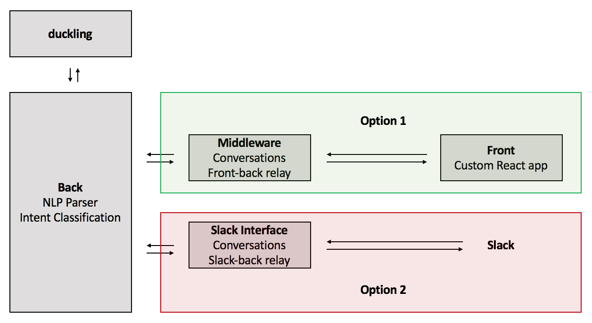
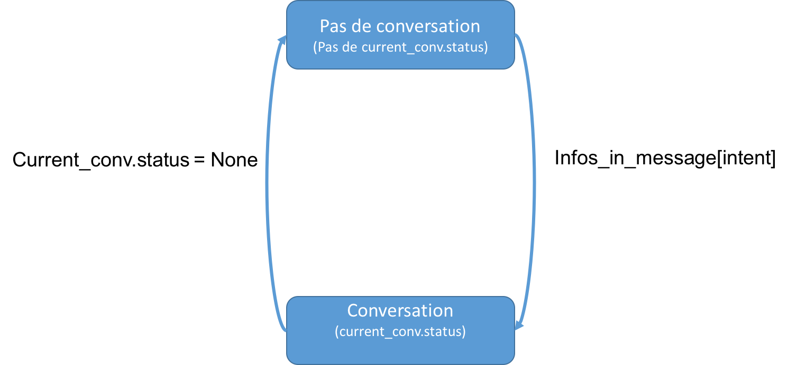

# Documentation

## Chemin général d'un message
L'utilisateur envoie un message.
Le **back** et le **middleware** vont alors réaliser des actions en parallèle.

### Fichier `Run.py`
Le **back** (lancé via le fichier `run.py`) fait les actions suivantes :
- Fichier `views.py`, fonction 'app.route('/parser/<to_classify>/<path:msg>')' -> Appel le **parser** pour le message envoyé par l'utilisateur
- Fichier `parse.py`, fonction parse_message -> *parser* le message.
- Fichier `parser_city.py` et `parser_time.py` -> Fonction pour parcourir le message envoyé par l'utilisateur quoi qu'il arrive et récupérer les éventuelles informations sur ville/ date/ horaires.
- Fichier `classifier.py` -> Prend le message *parsé* et appelle **spacyjob**.
- Fichier `spacyjob.py` -> Prend le message *parsé* et transforme la phrase en vecteur puis la renvoie au *classifier*.
- Fichier `classifier.py` -> Prend le vecteur et utilise la fonction de classification afin de détecter une intention. Renvoie l'intention finale détectée.

### Fichier RunMiddleware.py
Le **middleware** (via le fichier `runMiddleware.py`) réalise lui les actions suivantes :
- Fichier `controller.py` -> Deux fonctions systématiquement utilisées : *handle_conversation* et *get_conversation*.
- Fichier `conv_handler.py` -> Traiter l'intention du message pour ensuite savoir quel type de conversation ouvrir ou non.
- Fichier `http_helper.py` -> permet de nettoyer le message envoyé (fonction *clean_msg_for_url*) pour qu'il soit traité de façon optimale.
- Ouverture du fichier conversation correspondant à l'intention détectée (ConvHandler, ConvArbre, ConvNameInfo, ConvVoyage, ConvSmallTalk, ConvAnnulation, ConvHotel).
- Renvoie d'un message adapté à l'utilisateur en fonction de la conversation qui a été ouverte.

## Organisation des serveurs

Pour utiliser le bot, on dispose pour le front de deux options :  

- Utiliser l'interface [Slack](https://slack.com)
- Utiliser l'interface indépendante créée spécialement pour le bot

Dans tous les cas, on doit lancer le back et le serveur Duckling.

### Duckling

C'est le serveur qui utilise l'outil [Duckling](https://github.com/facebook/duckling) développé par Facebook. Il permet de détecter dans les phrases les éléments qui réfèrent à des dates (comme "demain soir" ou "jeudi 12 décembre"). Il peut aussi détecter d'autres types de grandeurs, mais nous n'avons dans notre cas besoin que des dates. Il est écrit en Haskell, et nécessite d'avoir installé un interpréteur pour ce langage : nous recommandons l'installation de `stack`.  
Une fois lancé, on peut lui faire des requêtes POST contenant la chaîne de caractère à analyser, et on reçoit en réponse un objet JSON contenant les informations détectées.

### Back

C'est un serveur [Flask](http://flask.pocoo.org/).
C'est dans le back que se trouve tout l'aspect de compréhension des phrases de l'utilisateur. Il contient deux grands éléments :
- Le **parser**, qui analyse à l'aide d'expressions régulières les informations qu'il peut trouver dans la phrase de l'utilisateur
- Le **classifier**, qui reconnaît les intentions de l'utilisateur à partir de banques de données de phrases.

On lui fait des requêtes POST, contenant la phrase à analyser, et on reçoit en réponse toutes les données intéressantes sur la phrases pour pouvoir construire une réponse.

Le but d'une requête au back est double : on doit à la fois établir l'intention de l'utilisateur (en utilisant le classifier), et récupérer les données importantes relative à cette intention. Par exemple, dans la phrase : *'je veux un train pour Paris'*, on doit détecter que l'intention est de prendre un train, et que Paris est une destination du voyage.

### Option 1 : Front en React

Si on choisit la première option pour le front, on doit lancer deux serveurs.

#### Middleware

C'est un serveur [Flask](http://flask.pocoo.org/).
Le middleware assure la connexion entre le front et le back. Il reçoit les messages tapés par l'utilisateur dans l'interface, et renvoie à l'interface les réponses du bot à afficher.  
Il gère aussi toute la logique de conversation, une fois que les informations du message de l'utilisateur ont été extraites par le back.

#### Front

Notre front est écrit en `React.js`. Il utilise le canevas de chatbot [react-simple-chatbot](https://lucasbassetti.com.br/react-simple-chatbot/). Il contient aussi la logique de connexion au middleware.

### Option 2 : Front Slack

Si on veut utiliser Slack, on n'a besoin que de lancer un seul serveur, qui remplace le middleware, puisque l'interface graphique est servie par Slack.

#### Interface Slack

Pour déployer le bot sur Slack, il faut d'abord créer un nouveau bot avec leur interface graphique, ce qui permettra de récupérer un token de connexion. Celui-ci peut être utilisé comme variable d'environnement : il suffit alors de lancer notre slackinterface pour connecter le bot de l'interface Slack à notre back.

## Classification

### Utilisation courante

La classification se déroule en deux étapes :

- Dans le fichier `Classifier/spacyjob.py` : on *tokenise* d'abord la phrase de l'utilisateur, c'est-à-dire qu'on la transforme en un vecteur de *float* de dimension 300. On utilise pour cela la librairie python `SpaCy`.

- Dans le fichier `Classifier/classifier.py`: on analyse le vecteur issu de l'opération précédente à l'aide du *classifier*, qu'on a au préalable entraîné à reconnaître des intentions sur un ensemble de phrases d'entraînement qu'on a tapées nous mêmes. Celui-ci prend en entrée un vecteur de dimension 300 et renvoie une des intentions prédéfinies que le classifier sait reconnaître.

- Le fichier `Classifier/nnclassifier.pkl` constitue le classifier lui-même. Il est généré à partir des phrases d'entraînement, par le script `train_bot_script.py`.

### Parser

Le parser est organisé en 3 fichiers :

- `parse.py`, qui contient une fonction `parse_message`: c'est la seule fonction du back appelée par le middleware. On gère ici le parsing basique des phrases pour reconnaître des intentions élémentaires qui n'ont pas besoin de passer par une classification (comme *'oui'* ou *'annuler'*). C'est ce fichier qui fait appel à `parser_city.py` et `parser_time.py`.

- `parser_city.py` gère la détection des villes dans les phrases, et si ce sont des villes d'origine ou d'arrivée pour les voyages. On utilise des données fournies par la SNCF répertoriant les communes où on trouve des gares.

- `parser_time.py` gère la détection des dates dans les phrases. C'est en particulier ce fichier qui fait appel à Duckling, et qui analyse et traite sa réponse.

### Modification du classifier

#### Entraînement du classifier

Pour simplement entraîner le classifier, il suffit de lancer `train_bot_script.py`. Celui-ci va créer un fichier `nnclassifier.pkl` à partir des phrases d'entraînement.

#### Ajout d'une catégorie dans le classifier

Pour ajouter une catégorie à détecter par le classifier - par exemple *'avion'* -, il faut suivre les étapes suivantes :

- **Ajouter les phrases d'entrainement** : dans le dossier `Data/Entrainement`, créer un fichier avec le nom de la catégorie à détecter. Y entrer des phrases d'exemple, qui pourraient matcher avec la catégorie *'avion'*, par exemple : *'je veux prendre un avion'*, *'je veux un avion'*, etc.
- **Ajouter le path dans le fichier dans `pythonconfig.py`** : ce fichier rassemble les chemins des différents fichiers, en particulier ceux d'entraînement. Il faut ajouter le chemin du fichier dans les chemins (dans la première partie du fichier), ainsi que l'ajouter à la liste `data_paths` qui contient les fichiers spécifiques à l'entraînement. **Attention** : il faut respecter un certain ordre pour que l'entraînement soit valide, nous conseillons de respecter l'ordre alphabétique que nous avons suivi dans cette liste.
- **Éditer le fichier `train_bot_script.py`** : on doit ajouter le nom de la classe à détecter (dans notre cas, *'avion'*) à la liste des classes détectables. **Attention** : il faut impérativement respecter le même ordre pour cette liste que pour celle précédente.

## Front

Le front est une application en [React](https://reactjs.org/). Elle utilise le canevas [react-simple-chatbot](https://lucasbassetti.com.br/react-simple-chatbot/).

## Conversations

Le fonctionnement général du chatbot est celui d'une machine à état. C'est à dire que la conversation qui est responsable de la réponse (du traitement du message) dépend de l'état dans lequel est le bot. Cet état est visible par `conv_handler.py`.

### Généralités
Fonctionnement global d'une conversation : une conversation hérite de la classe `AbstractConv`, c'est-à-dire qu'elle possède au moins une méthode `response`. Il faut aussi qu'elle ait un état représenté par un attribut `status`.
Ce statut peut être soit le nom de la conversation (train, voyage, etc...) soit None. C'est cet attribut qui permet de savoir quelle conversation doit traiter le message reçu.

Il y a plusieurs types de conversation possibles :
- Les conversations qui ne font qu'un message (sans persistance donc) ex : `conv_small_talk.py`
- Les conversations qui enregistrent des infos
- Les conversations de type arbre qui ne font que la réponse

##### Conversation train / hôtel / enregistrement
`conv_train.py`, `conv_hotel.py`, `conv_name_infos.py` fonctionnent toutes de la même manière. Un tableau (`infos_needed`) contient les informations dont on a nécessairement besoin avant de finir la conversation. Tant que ce tableau n'est pas vide la conversation est dans un état de récupération d'infos et on pose les questions correspondant aux infos dont on a besoin. La variable `info_asked` stocke la dernière question posée pour traiter correctement la réponse de l'utilisateur. Ensuite, quand on a toutes les informations dont on a besoin on effectue les checks de cohérence puis le récapitulatif apparaît. La partie de récupération d'infos est quasiment toujours la même, seules les `infos_needed` et les question changent. Ce sont les fonctions annexes et le récapitulatif de la conversation qui varient fortement.

##### Conversation voyage
`conv_voyage.py` est particulière : en effet on récupère des infos dans cette conversation et on appelle d'autres conversations (train et hôtel). C'est ce type de conversation qu'il est difficile de reproduire.

##### Conversation arbre
`conv_arbre.py` est très simple de fonctionnement. En effet, il suffit de répondre à l'utilisateur, pas de sotckage d'infos.  
Il suffit de rajouter les phrases au fichier `conv_arbre_config` pour ajouter d'autres arbres.

##### Conversation handler
`conv_handler.py` est responsable de la distribution du message et des infos contenues dans ce message.

##### Conversation annulation
`conv_annulation.py` est la conversation qui est appelée par la conversation à annuler quand l'utilisateur dit *"annulation"*. Si jamais l'utilisateur confirme la demande d'annulation la conversation est annulée.

#### Ajouter une conversation
Pour ajouter une conversation de type arbre il faut ajouter les phrases au fichier `conv_arbre_config.py`. Pour ajouter une conversation de type train ou hôtel il faut s'inspirer très fortement de celles qui existent déjà.

## Base de données :
### Création de base de données SQLAlchemy
Nous avons choisi d'utiliser SQLAlchemy (fonctionnement lié à [Flask](http://flask.pocoo.org/)) pour la création de la base de données.
La création se fait via le fichier `db_create.py` (et entraîne la création du fichier app.db), qui n'est à lancer qu'une fois.

Ensuite différents fichiers permettent de la manipuler :
- `models.py` qui permet de créer des tables de données. On créé `User` avec les champs nécessaires (champs repris a partir des anciennes fiches voyages générées par le formulaire SVP).  
Par ailleurs, on crée les fonctions associées au modèle : il n'y en a qu'une pour l'instant `save_to_bdd` qui permet d'enregistrer des profils.
Cette fonction `save_to_bdd` fonctionne avec des fonctions de lien avec le back et le front pour l'ajout de profil qui sont dans les fichiers suivants :
- `views.py`
- `http_helper.py`

### `Views.py` : manipulation de la base de données
Le fichier `views.py` est un fichier qui permet de définir les routes et leur fonction.
Les routes `/add_bdd`, `/users/<path:user_id>` et `/delete_bdd/<path:user_id>` sont toutes en lien avec la base de données : elles permettent respectivement d'ajouter un utilisateur en base de données, de regarder un profil en base de données et de supprimer un profil en base de données.
Nous avons choisi de ne pas faire de fonction modifier : néanmoins il est possible de modifier son profil (depuis le front). La conséquence en base de données est la suppression du profil puis la création d'un nouveau profil.

### `http_helper.py` : lien entre requête HTTP et base de données
Le fichier `http_helper.py` permet quant à lui de faire le lien entre le back et le front. En effet nous n'avons pas différentes pages avec différents URLs car toute l'IHM se trouve uniquement sur la page du chat (unique page web). `http_helper` permet donc de passer des requêtes HTTP aux URLs.   
Pour la base de données, nous avons donc créé des fonctions qui passent les requêtes Http aux fonctions concernées : `http_bdd` (pour ajouter un utilisateur), `http_get_user` (pour aller chercher un utilisateur en base de données) et `http_delete` (pour supprimer un utilisateur).

## Mails et fiches voyage

### Fichier `fiche_voyage.py`
Ce fichier permet la création de fiches voyages (soit train soit hôtel) et est appelé à  la fin d'une conversation voyage. En effet, pour être construit il faut les différents éléments des dictionnaires `infos_perso` et `voyage`. Il utilise le module **reportlab**, module python spécialement conçu pour la génération de PDF.

Dans ce fichier, on a créé deux fonctions différentes pour la génération de "fiche train" ou de "fiche hôtel". Avoir deux fonctions différentes permet de créer des fiches indépendantes et donc de correspondre aux exigences de la MNT à ce propos.
Néanmoins, nous avons mis une indication sur la fiche elle-même pour préciser s'il y a un lien avec une autre fiche pour un voyage pour faciliter le travail du service qui gère la réservation.

### Fichier `mail.py`
#### Paramètres du serveur mail
Il existe un module natif en Python pour envoyer des courriels: **smtplib**. Il n'y a donc pas besoin d'ajout de module externe.
Pour utiliser ce module il faut :
- l'importer (ligne 6 du fichier)
- importer les modules `email.mime.text`, `email.mime.base` et `email.mime.multipart` qui permettent d'envoyer un mail sophistiqué (avec un contenu, un objet, une pièce jointe, etc.)
- définir les paramètres du serveur, c'est à dire le paramètre utilisé et son numéro de port (ici spécifique à l'utilisation de Gmail - il faudra les modifier pour l'utilisation d'une autre messagerie).

#### Paramètres pour l'envoi du mail
Pour l'envoi de mail, les champs suivants sont nécessaires :
- votre adresse mail d'envoi (`adressfrom`) : pour nos tests, nous avons choisi d'en créer une : *chatbot.projetdty@gmail.com*, vous pourrez sans problème la remplacer.
- le mot de passe lié à l'adresse mail du compte. Il est pour l'instant codé en dur mais l'utilisation de la fonction `getpass` (module `getpass`) permettra de remédier à ce problème.  
- l'adresse mail du destinataire : toutes les personnes concernées par le voyage pour l'instant (le demandeur, les voyageurs et en copie l'expéditeur)
- l’objet du courriel
- le corps du message
- pour l'envoi de pièce jointe, c'est un peu plus compliqué. L’étape essentielle est de convertir le fichier joint en Base64, avant de l’envoyer. Ce code fonctionne pour envoyer des fichiers textes, des pdfs, des photos, de l’audio ou de la vidéo (même si ici on se contentera a priori de l'envoi de PDF).
En plus des informations citées précédemment, cette fois-ci, il faut aussi indiquer le nom du fichier et le chemin d’accès du fichier.

## Connexion aux APIs

Pour la météo on utilise [darksky](https://darksky.net/dev), pour les trains l'API de la [SNCF](https://data.sncf.com/api/v1/console/datasets/1.0/search/).
Pour comprendre cette API il faut regarder la documentation de  [Navitia](https://canaltp.github.io/navitia-playground/).

De manière générale si l'une des apis que l'on utilise ne répond pas pour une raison quelconque, on échappe les erreurs et le bot ne plante pas.

### API SNCF

Limitée à 150 000 requêtes par mois (5000 requêtes par jour). Les trains ne sont pas disponibles à plus de 45 jours.
Ne permet pas d'obtenir des données commerciales sur les trains. De plus il faut utiliser leur fichier de donnée `/flaskBack/Data/gares.json` qui associe à chaque gare un code commune unique.

### API météo
Limitée à 1000 requêtes par jour. Permet d'obtenir des données à la seconde près mais on utilise simplement le résumé du temps qu'il fera sur une journée. La prévision est limitée à 7 jours.
